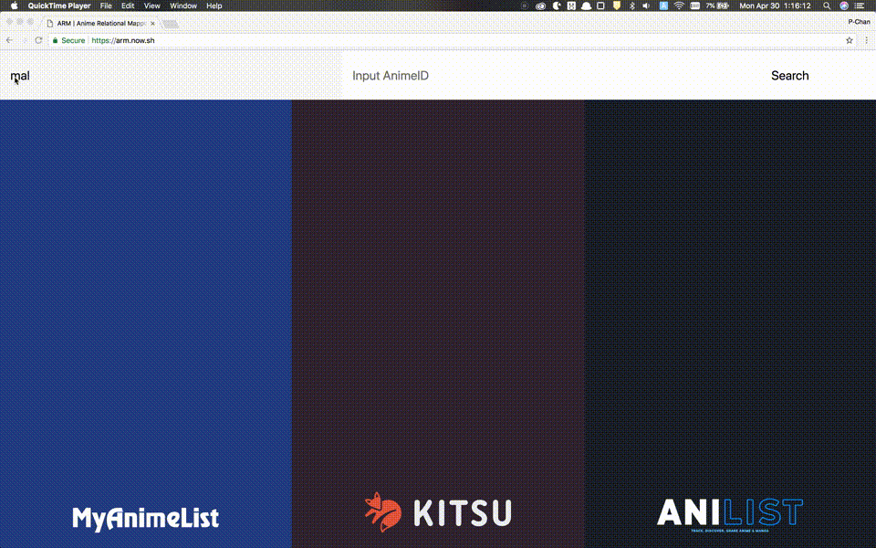

# ARM

> AnimeID Relational Mapper

ARM is a web service linking AnimeID of MyAnimeList and Kitsu and AniList.
This is not only a website. It also provides a JSON API.
It is useful for creating services that make full use of the strengths of each anime database service.



## Support services

- MyAnimeList
- Kitsu
- AniList

## Install

```
$ git clone https://github.com/p-chan/arm.git
$ cd arm
$ npm install
$ npm start
```

## Documents

ARM provides JSON API for developers.

### Endpoints

```
[GET] https://arm.now.sh/api/v1/search
```

### Parameters

| Parameter | Value | Required |
|:---|:---|:---|
| type | `mal` or `kitsu` or `anilist` | `true` |
| id | number | `true` |


### Example

#### Request

```
[GET] https://arm.now.sh/api/v1/search?type=mal&id=35849
```

#### Response

```
{
  "services": {
    "mal":"35849",
    "anilist":"99423",
    "kitsu":"13600"
  }
}
```

## Author

[@p-chan](https://github.com/p-chan)

## License

[MIT](LICENSE)
